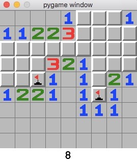

# Minesweeper

A simple clone of the minesweeper game with 9x9 grid and 10 mines, written in Python.



## Prerequisites

1. Python 3.6
1. Pygame

## Installation

Clone the repo
```
git clone https://github.com/khansubhan95/minesweeper
```

Install dependencies
```
pip3 install -r requirements.txt
```

Enter into the cloned repo and run
```
python3 minesweeper.py
```
to run the game

## How to play

Each number on a tile represents the number of mines in the neighbouring tiles. The neighbors to a tile are the 8 tiles surrounding it. Clicking on a mine ends the game. If you think you have found a mine, right click to place a flag on it. Placing the 10 flags at the correct mine positions(finding all the mines), makes you win the game.
